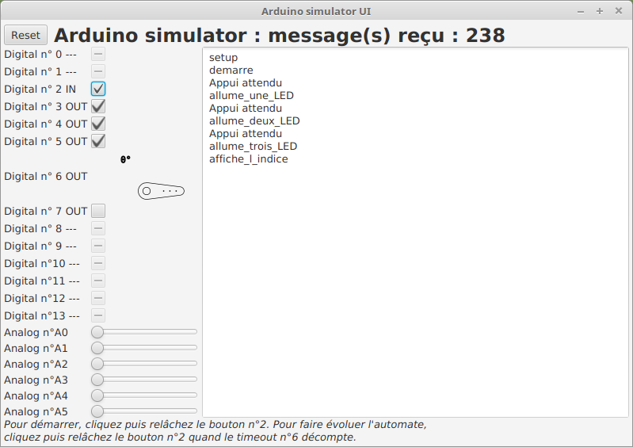
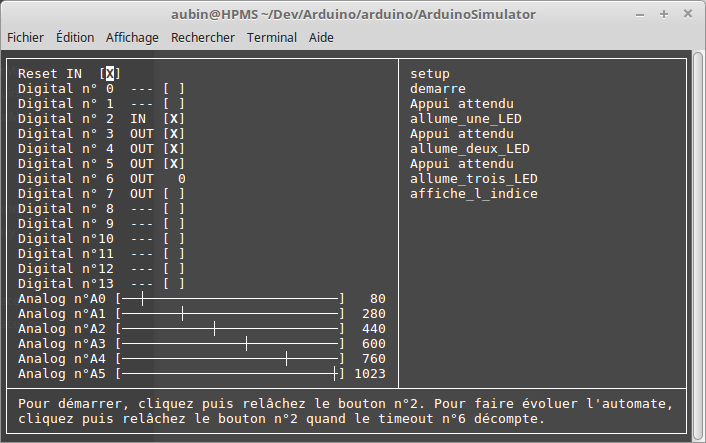
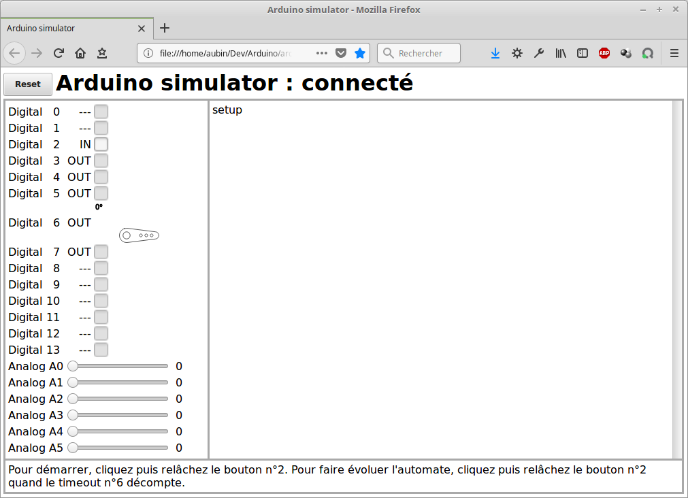
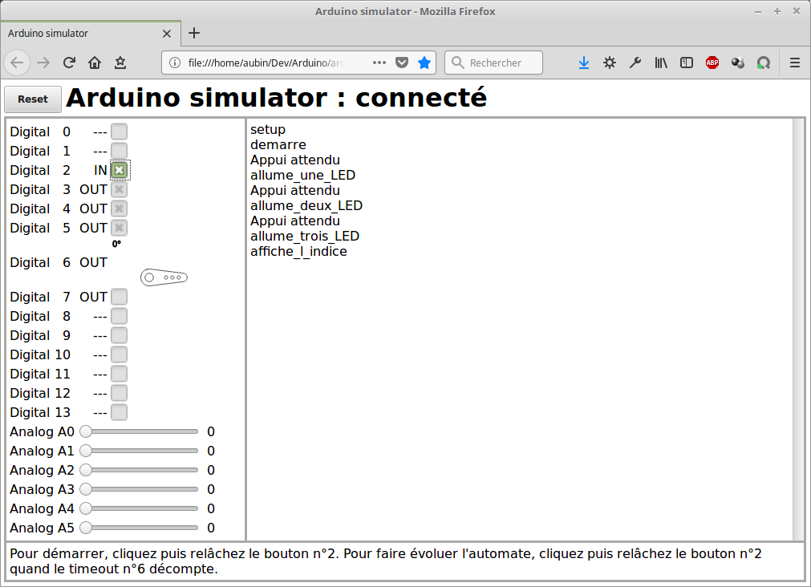

# Arduino UNO

Partage d'un projet Arduino avec [Max](https://github.com/exancillatus) :

Pour consulter la documentation de IfThenElsePourMax, c'est
[par ici !](https://aubinmahe.github.io/arduino/IfThenElsePourMax/doc/html/index.html)

## ArduinoSim project ##

J'ai développé [Un simulateur minimaliste](ArduinoSimulator) pour Arduino UNO
avec [une IHM](hpms.app.arduinosim) en Java,
 [une autre](ArduinoSimulator/src/ncurses) au moyen de *ncurses*
 et [une dernière](ArduinoSimulator/src/ws) en utilisant une Web Socket pour
 afficher l'IHM dans un navigateur.

* Il route les appels aux routines Arduino vers des appels systèmes UNIX, les entrées/sorties sont simulées au moyen des interfaces, JavaFX ou ncurses.

* Attention, pour simuler un appui bouton, il faut cocher puis décocher, pour bien voir les deux états enfoncé/relâché d'un bouton poussoir.

Voici deux captures d'écran concernant l'IHM *Java* :

* Au repos : 

* En fin de sequence : 

Voici deux captures d'écran concernant l'IHM *ncurses* :

* Au repos : 

* En fin de sequence : 

Voici deux captures d'écran concernant l'IHM *WebSocket* (Firefox) :

* Au repos : 

* En fin de sequence : 

### Comment utiliser le simulateur ? ###

**Lisez d'abord toutes les étapes.**

1. Téléchargez [l'archive](https://aubinmahe.github.io/arduino/ArduinoSimulator/arduinosim-1.0.tar.gz)

1. Dans un terminal, entrez la séquence habituelle :

       $> tar xzf arduinosim-1.0.tar.gz
       $> cd arduinosim-1.0
       $> ./configure [--prefix chemin-absolu]
       $> make
       $> sudo make install

1. Si tout c'est bien passé, les fichiers suivants auront été déployés sur votre machine et `<prefixe>` sera `/usr` ou `/usr/local` selon votre distribution ou si vous avez entré `./configure --prefix <votre préfixe>`.

       <prefixe>/share
       <prefixe>/share/arduinosim
       <prefixe>/share/arduinosim/ws-ui
       <prefixe>/share/arduinosim/ws-ui/index.html
       <prefixe>/share/arduinosim/ws-ui/css
       <prefixe>/share/arduinosim/ws-ui/css/arduinosim.css
       <prefixe>/share/arduinosim/ws-ui/js
       <prefixe>/share/arduinosim/ws-ui/js/arduinosim.js
       <prefixe>/share/arduinosim/ws-ui/favicon.ico
       <prefixe>/share/arduinosim/java-ui
       <prefixe>/share/arduinosim/java-ui/hpms.fx.angle.jar
       <prefixe>/share/arduinosim/java-ui/hpms.app.arduinosim.jar
       <prefixe>/lib
       <prefixe>/lib/libarduinosim.a
       <prefixe>/include
       <prefixe>/include/arduinosim
       <prefixe>/include/arduinosim/Servo.h
       <prefixe>/include/arduinosim/Arduino.h
       <prefixe>/bin
       <prefixe>/bin/arduinosimsample

* Les fichiers sous `share/arduinosim` sont les fichiers nécessaires aux IHM Java et WebSocket, voir plus bas le mode d'emploi.

* Bien sûr, le code source de votre développement Arduino est inchangé, par contre le compilateur devra être paramétré pour utiliser cet environnement par `-I arduinosim` et l'éditeur de lien avec `-larduinosim -lncursesw -lm -lwebsockets -lpthread`. Par exemple, en utilisant les variables d'un Makefile *classique* :

      CXX      = g++
      CXXFLAGS = -W -Wall -g3 -O0 -std=c++11 -I src/arduinosim -DDEBUG
      LDFLAGS  = -larduinosim -lncursesw -lm -lwebsockets -lpthread

* Pour exécuter la simulation une fois votre programme compilé et lié, il faut
  spécifier l'IHM souhaitée :

      MonBeauProgramme --ui=java
      MonBeauProgramme --ui=ws-ui
      MonBeauProgramme --ui=ncurses

  * Dans le cas **Java**, il vaut mieux lancer l'IHM d'abord pour ne perdre
  aucun événement :

        java -jar <prefixe>/share/java-ui/hpms.app.arduinosim.jar &

  * Dans le cas **WebSocket**, il vaut mieux lancer l'IHM d'abord pour ne perdre
  aucun événement :

        firefox <prefixe>/share/ws-ui/index.html &

  * Dans cas **ncurses**, l'IHM est intégré au simulateur. On peut fournir un
  fichier `instructions.txt` de façon à peupler les deux lignes de status
  avec une aide de votre composition.
