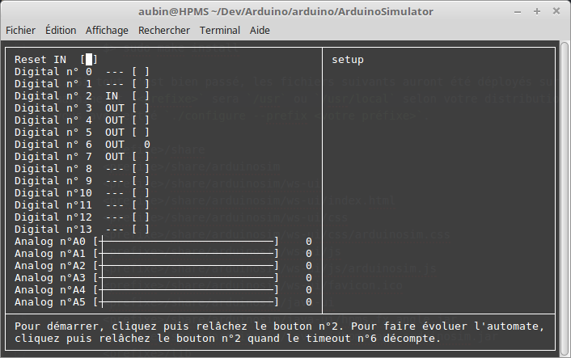

# Arduino UNO

Partage d'un projet Arduino avec [Max](https://github.com/exancillatus)

Pour consulter la documentation de IfThenElsePourMax, c'est
[par ici !](https://aubinmahe.github.io/arduino/IfThenElsePourMax/doc/html/index.html)

J'ai développé [Un simulateur minimaliste](ArduinoSimulator) pour Arduino UNO avec [une IHM](hpms.app.arduinosim) en Java et [une autre](ArduinoSimulator/src/ncurses) au moyen de *ncurses*.

* Il route les appels aux routines Arduino vers des appels systèmes UNIX, les entrées/sorties sont simulées au moyen des interfaces, JavaFX ou ncurses.

* Attention, pour simuler un appui bouton, il faut cocher puis décocher, pour bien voir les deux états enfoncé/relâché d'un bouton poussoir.

Voici deux captures d'écran concernant l'IHM Java :

* Au repos : 
* En fin de sequence : 

Voici deux captures d'écran concernant l'IHM *ncurses* :

* Au repos : 
* En fin de sequence : 
